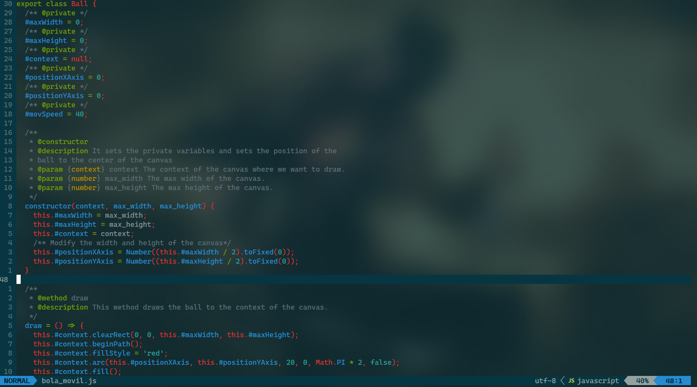
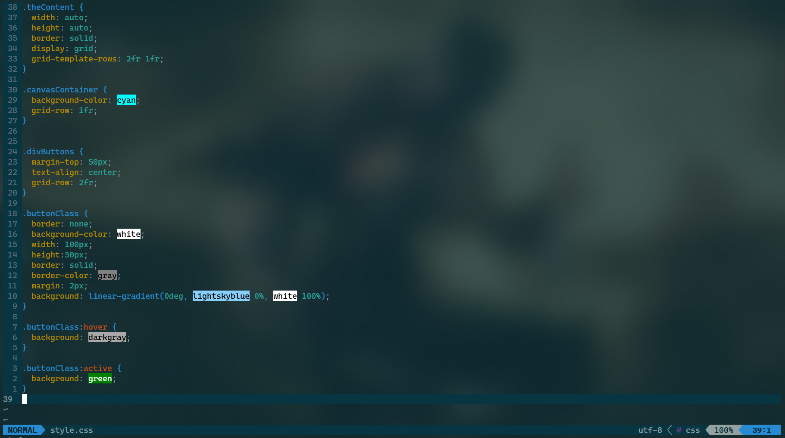
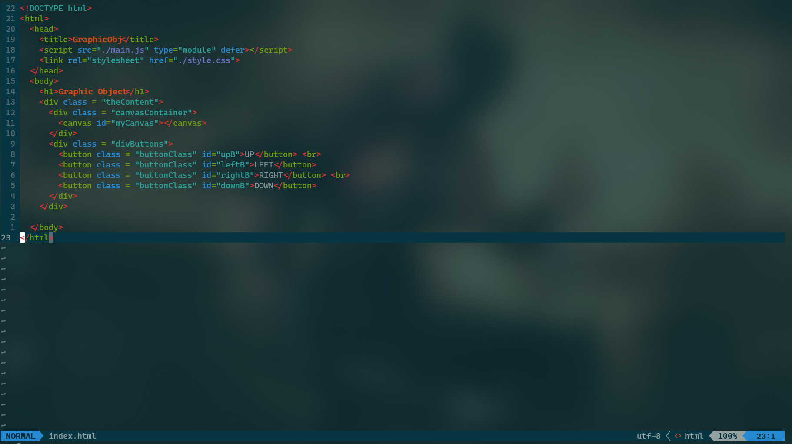
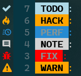
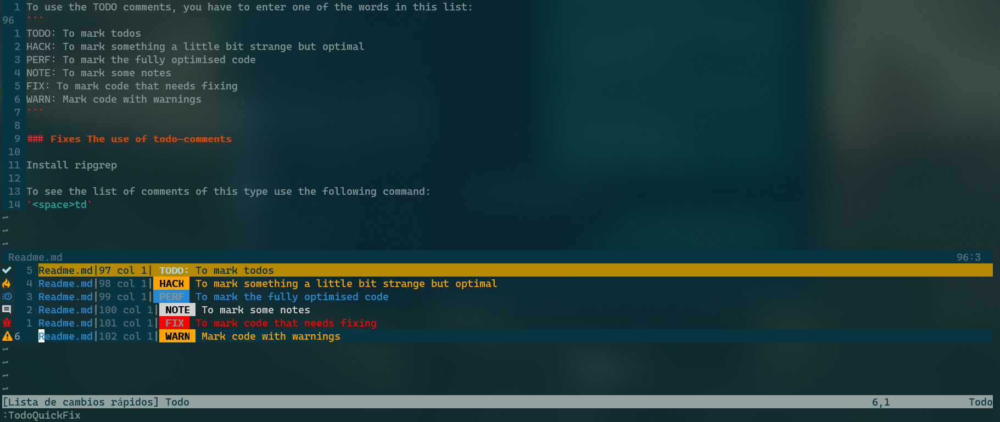
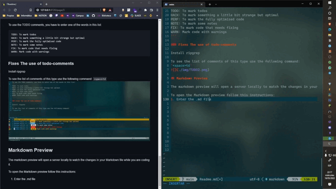

# Nvim configuration
**Original author:** devaslife

**Youtube channel:** [devaslife](https://www.youtube.com/watch?v=FW2X1CXrU1w&t)

**Added more plugins and support:** Lucas Hernández Abreu

**Email:** alu0101317496@ull.edu.es

If you have some issue, don't hesitate to contact me or open a github issue in this repo with your problem, I will try 
to answer with the solution as fast as possible.

----

# Preview
### JS Support Highlight

### CSS Support Highlight and color helper

### HTML Support Highlight


All the highlight comes from the use of TreeSitter for Nvim

# Installation

First of all we need to install nvim. For all this plugins to work we need a 0.5 or higher version of Nvim.

In Windows we can go to
[this page](https://github.com/neovim/neovim/wiki/Installing-Neovim) and follow the instructions for installation in Windows.

In Linux we have to use the following commands:
```bash
sudo add-apt-repository ppa:neovim-ppa/unstable
sudo apt-get update
sudo apt-get install neovim
```
In Mac we use:
```bash
brew install neovim
```

## The `setup.sh` file

After installing neovim you must install the plugin manager and node.
Use this file to automatically install the NVM and the Vim Plug.

The file contains the following code: 
```bash
# VIM PLUG
sh -c 'curl -fLo "${XDG_DATA_HOME:-$HOME/.local/share}"/nvim/site/autoload/plug.vim --create-dirs \
       https://raw.githubusercontent.com/junegunn/vim-plug/master/plug.vim'
# NVM
curl -o- https://raw.githubusercontent.com/nvm-sh/nvm/v0.39.1/install.sh | bash

echo "EJECUTE LO SIGUIENTE:"
echo ""
echo ""

cat ./nvm.txt
```

Follow the instructions given after the use of this file to complete the installation.

**NOTE:** I recommend to install the latest stable version of node for this configuration of nvim to work. 

## Configuring nvim

In linux go to `$HOME/.config/` and clone this repo there. Then change its name to `nvim`.

Open the editor with `nvim` and then use `:PlugInstall`.
If you see errors make sure the Python3/Python2 support and the Node support is enabled. To see this, enter `:checkhealth`.

In the `init.vim` file you will see this lines:

```vim
if has("unix")
  let g:python3_host_prog = "/usr/bin/python3"
else
  let g:python3_host_prog = "C:/Python310/python.exe"
endif
```

This lines tell nvim where is the python executable located.

## Customization

In the folder you have some `*.vim` files, this files are the configuration
for nvim. The key bindings and color themes are stored and asigned in this files.

Use this files as you please for getting the most comfortable configuration for you.

As an example I have bound `:w` and `:q` to `<space> + w` and `<space> + q`, also
I have bound the `:!` for command execution to the `<space> + r` combination.

# Plugins
All the plugins are installed with the `Plug` vim plugin manager. To add or delete plugins
go to the `plug.vim` and delete or add lines.
## DEFX
*Search for files or create files*
<br>
To initiate the file explorer press:
```vim
<Space> + nt
```
### Options
**Open file**
"\<CR\>", "l" or "o"

**New file**
Press "N" and write the name

**Navigate:**
- "k": up
- "j": down
- "l": open the file
- "h": go back -> `cd ..`


## TreeSitter

This is the fundamental part of this project, it solves the lack of highlighting in vim and nvim with the 
contribution of a open community that is developing all the support for different languages.

To know which highlighting have you installed use: `:TSInstallInfo`

To install some language support use: `:TSInstall <name_of_language>`

You can see the name of the language in the `TSInstallInfo` command.


**NOTE:**
To get the support for the Javascript, CSS and HTML language install them with this commands:

```lua
:TSInstall html 
:TSInstall javascript
```

**NOTE:** Don't install the css package for TreeSitter because it is incompatible with the css color helper.


### Fixes the JSDOC in treesitter parser

Go to the folder with the data of nvim and enter `nvim-treesitter/queries/ecma/indents.scm`

At the end of the file change the following line to:
```scm
  [
    (comment) @auto 
    (template_string)
  ] @ignore
```

Now the problem will be temporally fixed.

## COC - Nvim
COC is a VScode intellisense like plugin, it has support for multiple languages.
To know if it has support for the language you use try searching in google the following query:
```Javascript
<Name_of_language> coc nvim
```
Then follow the instructions given in the page where the support for the language is implemented.

## TODO comments


To use the TODO comments, you have to enter one of the words in this list:
```
TODO: To mark todos
HACK: To mark something a little bit strange but optimal
PERF: To mark the fully optimised code
NOTE: To mark some notes
FIX: To mark code that needs fixing
WARN: Mark code with warnings
```

### Fixes The use of todo-comments

Install ripgrep

To see the list of comments of this type use the following command:
`<space>td`


## Markdown Preview

The markdown preview will open a server locally to watch the changes in your Markdown file while you are coding it.

To open the Markdown preview follow this instructions:
1. Enter the `.md` file
2. Write `:MarkdownPreview`
3. Enjoy the writting of markdown files.



